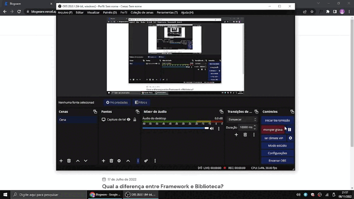

<h1 align="center">
    
  Blogware
</h1>

## :computer: Sobre

**Blogware** é blog pra quem consome tecnologia e desenvolve aplicações Front-End. Foi criado como forma de estudos em ReactJS, GraphQL e o CMS Hygraph.

Veja o resultado final em https://blogware.vercel.app/

---

## :hammer: Ferramentas

- [ReactJS](https://reactjs.org/)
- [Hygraph](https://hygraph.com/)

## Licença

